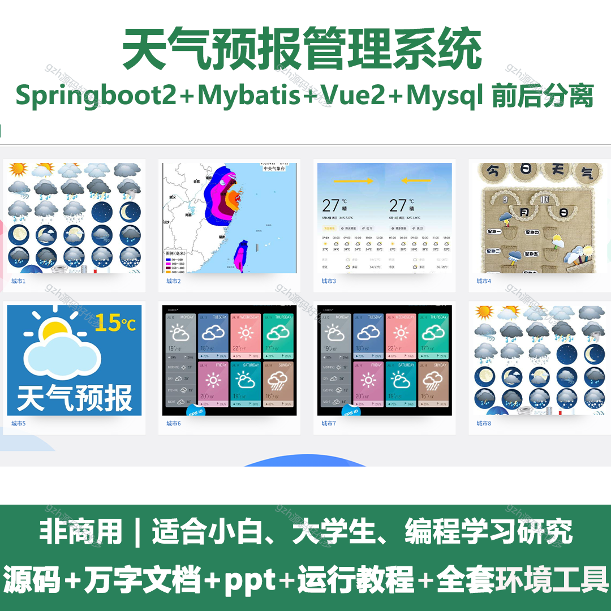
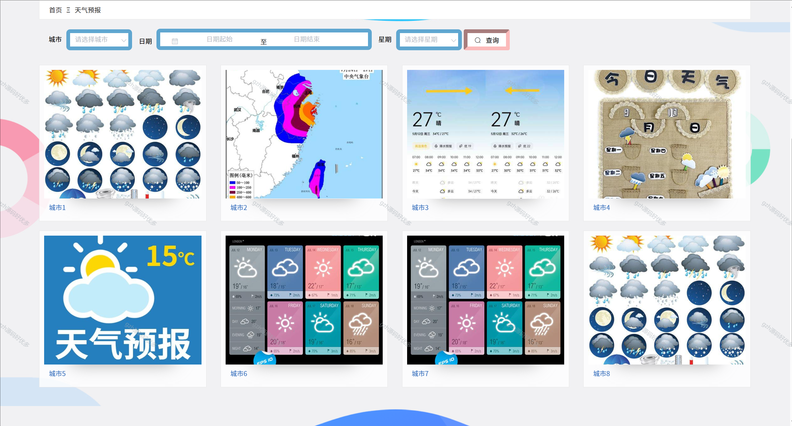
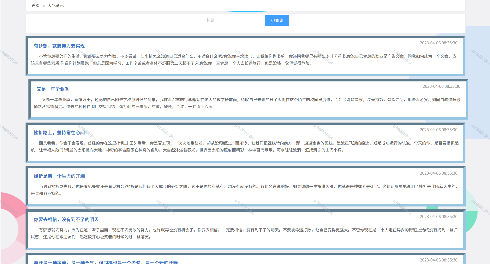
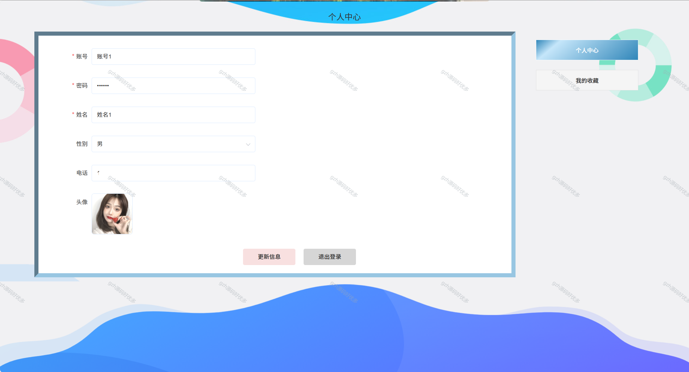
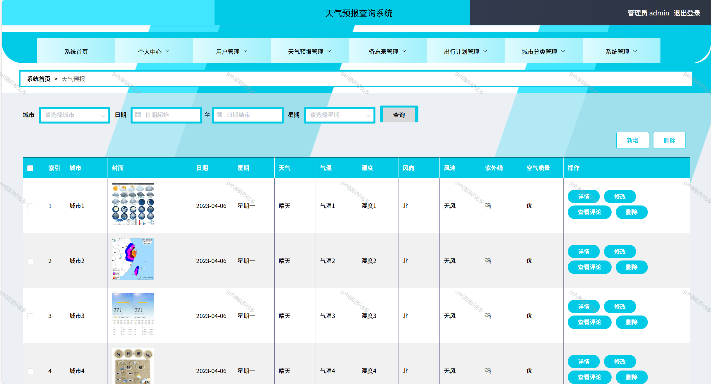
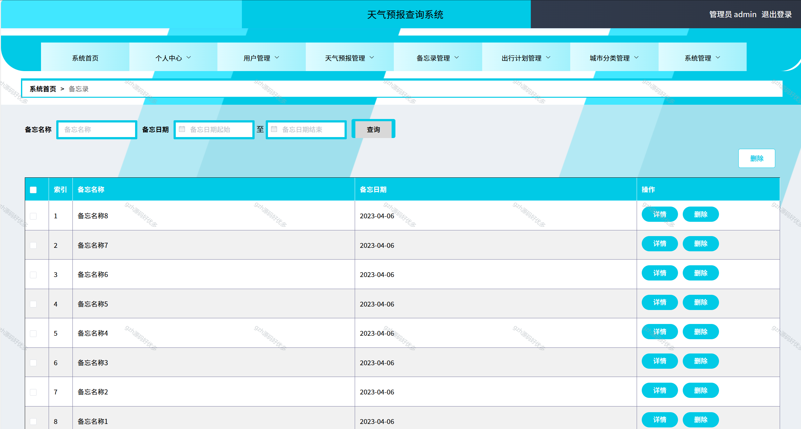
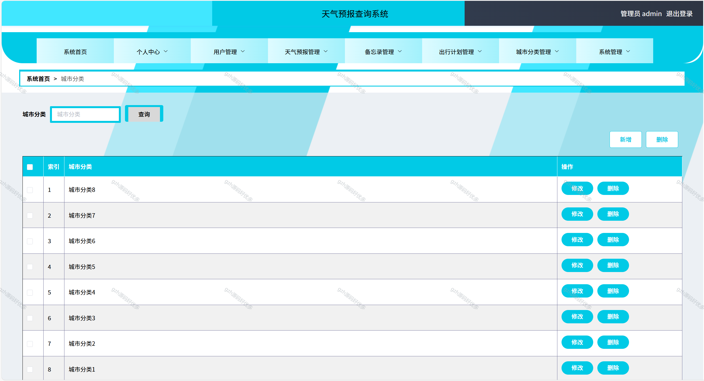
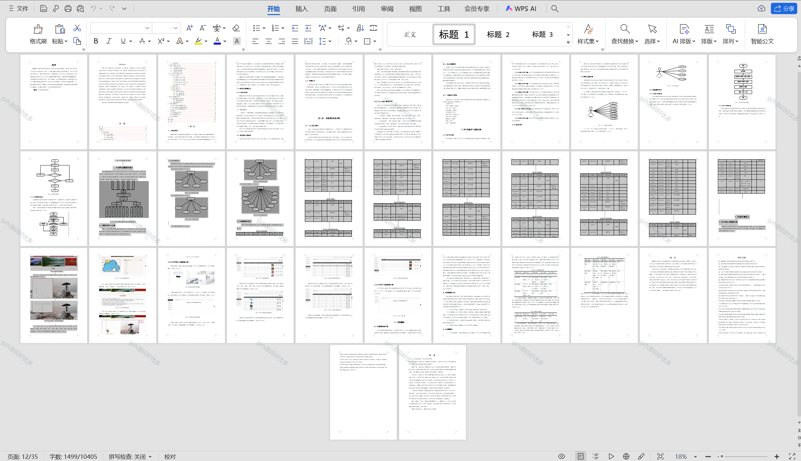

# springbootA218
springbootA218天气预报管理系统
  
## 查看主页获取源码

### 一、关键词
气象预报管理系统，天气预测管理平台，气象信息管理系统

### 二、作品包含
源码+数据库+设计文档万字+全套环境和工具资源+本地部署教程

### 三、项目技术
前端技术：Html、Css、Js、Vue2.0、Element-ui 
后端技术：Java、SpringBoot2.0、MyBatis

### 四、运行环境（以下版本亲测，其他版本未知，请自测）
开发工具：IDEA/eclipse  + VSCODE

数据库：MySQL5.7（最低要5.7版本）

数据库管理工具：Navicat10以上版本

环境配置软件： JDK1.8 + Maven3.6.3

前端Nodejs：14

浏览器：谷歌浏览器

### 五、项目介绍
项目编号：springbootA218

随着网络科技的不断发展以及人们经济水平的逐步提高，网络技术如今已成为人们生活中不可缺少的一部分，而信息管理系统是通过计算机技术，针对用户需求开发与设计，该技术尤其在各行业领域发挥了巨大的作用，有效地促进了天气预报管理的发展。然而，由于用户量和需求量的增加，信息过载等问题暴露出来，为改善传统线下管理中的不足，本文将提出一天气预报管理系统，计算机技术作为近十年来新发展起来的科技，可运用于众多领域中，尤其在天气预报管理中，可有效地提升其效率。提高现下天气预报管理系统的准确度，同时降低经济波动带来的不良影响

### 六、运行截图

 
